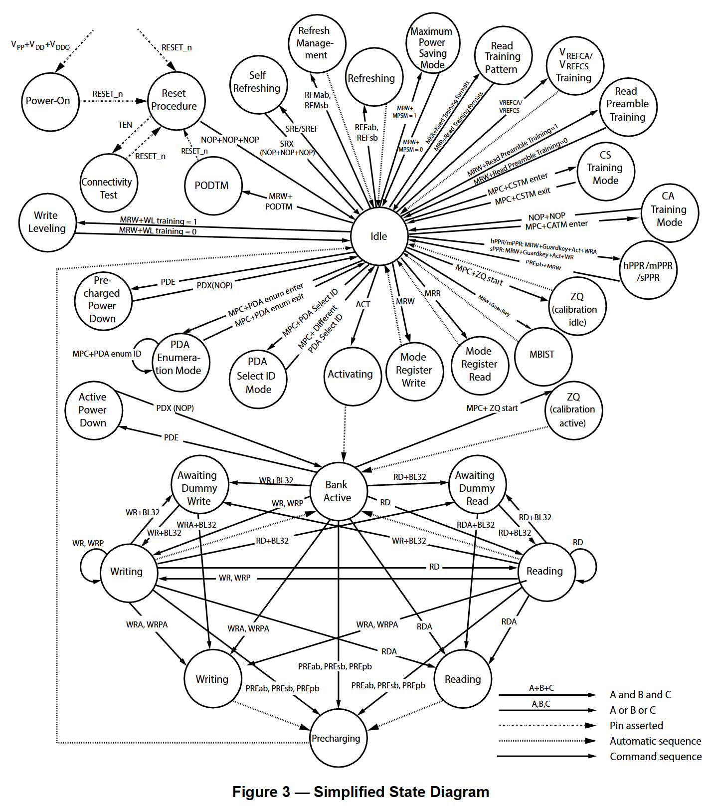
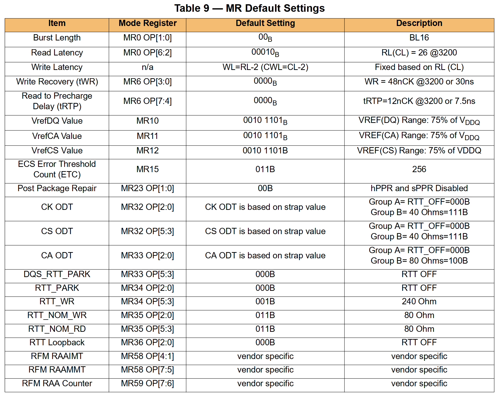
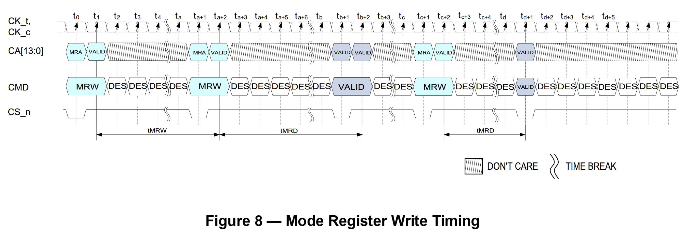
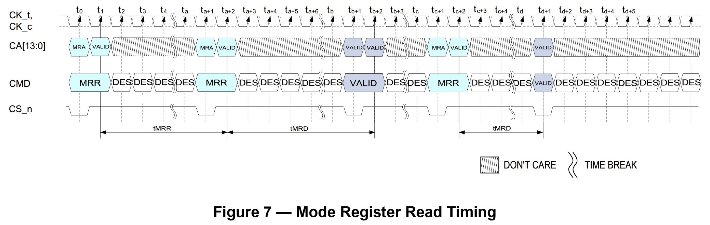
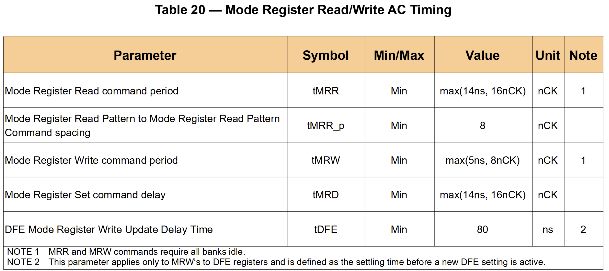

# 第三章 DDR5 SDRAM 功能描述

> **协议原文**: JESD79-5D, Section 3

---

## 3.1 简化状态图：一张图理解 DDR5 的所有状态

> **图 1**: Figure 3 — Simplified State Diagram (JESD79-5D Page 9)

Figure 3是 DDR5 的"技能图谱"——它用一张图展示了 DRAM 可能处于的所有状态、以及用什么命令可以在状态之间跳转。理解这张图不需要死记硬背——只需要抓住几个核心状态簇：

**核心操作簇**（中间偏左）：Idle ⇄ Bank Active ⇄ Reading/Writing ⇄ Precharging。这是 DDR5 最常见的状态循环——CMD: ACT → Bank Active → RD/WR → 数据 → PRE → 回 Idle。

**训练簇**（下方偏右）：CS Training Mode (CSTM) → CA Training Mode (CATM) → Write Leveling → Read Preamble Training → VrefCA/CS Training。这是初始化阶段的标准训练序列。进入和退出都通过 MPC 命令（MPC+CSTM enter / MPC+CATM enter 等）。

**电源管理簇**（左下方）：Idle → PDE → Active Power Down / Precharged Power Down → PDX 退出；或者 Idle → SRE/SREF → Self Refresh / MPSM → SRX 退出。注意 Self Refresh 退出时 DRAM 需要 NOP+NOP+NOP 来恢复内部时钟。

**ZQ 校准簇**（右上角）：Idle ⇄ ZQ Calibration（通过 MPC+ZQ start 进入）。校准过程中 DQ/DQS 总线可用，但 CA 总线必须保持 DES。

**刷新簇**（右下方）：Idle → REFab/REFsb → Refresh → 完成 → 回 Idle。还包括 RFMab/RFMsb（刷新管理）——由 ALERT_n 或内部计数器触发。

---

## 3.2 基本功能：DDR5 的操作骨架

### 3.2.1 16n Prefetch 架构

协议原文定义了 DDR5 的基本操作单元：

> "The DDR5 SDRAM uses a 16n prefetch architecture to achieve high-speed operation. The 16n prefetch architecture is combined with an interface designed to transfer two data words per clock cycle at the I/O pins. A single read or write operation for the DDR5 SDRAM consists of a single 16n-bit wide, eight clock data transfer at the internal DRAM core and sixteen corresponding n-bit wide, one-half clock cycle data transfers at the I/O pins."

翻译过来就是：DDR5 使用 16n Prefetch 架构来实现高速操作——内部 DRAM 核心以相对低频运行，**一次读写操作**从阵列中取出 16n-bit 宽的数据（x8 器件 = 16×8 = **128 bits**），在 8 个 CK 周期的内部传输中完成。这 128 bits 随后通过 I/O 引脚以每 CK 两个数据字的速率（DDR）在 16 个半时钟周期内串行输出——对应的接口 Burst Length = **16**。

注意协议原文强调的是"一次操作"而非"每 CK 周期"——内部 128-bit 的取出是一次 ACT+READ 操作完成后才发生的，不是在每个 CK 周期都在取。内部核心频率（~300 MHz for DDR5-4800）远低于接口频率。

### 3.2.2 Bank 组织

协议原文：

> "To ease transition from DDR4 to DDR5, the introductory density (8 Gb) shall be internally configured as 16-bank, 8 bank group with 2 banks for each bank group for x4/x8 and 8-bank, 4 bank group with 2 banks for each bankgroup for x16 DRAM. When the industry transitions to higher densities (=>16 Gb), it doubles the bank resources and internally be configured as 32-bank, 8 bank group with 4 banks for each bank group for x4/x8 and 16-bank, 4-bank group with 4 banks for each bankgroup for x16 DRAM."

即：
- **8 Gb 入门密度**：x4/x8 = 8 BG × 2 Bank/BG = **16 Banks**；x16 = 4 BG × 2 Bank/BG = **8 Banks**
- **≥16 Gb 密度**：x4/x8 = 8 BG × 4 Bank/BG = **32 Banks**；x16 = 4 BG × 4 Bank/BG = **16 Banks**

### 3.2.3 操作流程

协议原文定义了完整的读写流程：

> "Read and write operation to the DDR5 SDRAM are burst oriented, start at a selected location, and continue for a burst length of sixteen or a 'chopped' burst of eight in a programmed sequence. Operation begins with the registration of an ACTIVATE Command, which is then followed by a Read or Write command. The address bits registered with the ACTIVATE Command are used to select the bank and row to be activated (i.e. in a 16Gb part, BG0-BG2 in a x4/8 and BG0-BG1 in x16 select the bankgroup; BA0-BA1 select the bank; R0-R17 select the row; refer to 'DDR5 SDRAM Addressing' for specific requirements). The address bits registered with the Read or Write command are used to select the starting column location for the burst operation, determine if the auto precharge command is to be issued (CA10=L), and select BC8 on-the-fly (OTF), fixed BL16, fixed BL32 (optional), or BL32 OTF (optional) mode if enabled in the mode register."

即：每次读写 = ACTIVATE（选 BG+BA+Row）→ 等 tRCD → READ/WRITE（选 Col + BL\* + AP）→ 等 RL/CWL → 数据传输。**在正常操作前，DRAM 必须按预定义的流程上电并初始化：** "Prior to normal operation, the DDR5 SDRAM must be powered up and initialized in a predefined manner."

---

## 3.3 复位与初始化流程

### 3.3.1 MR 上电默认值（Table 9）

DDR5 在上电后、初始化前的默认状态由 Table 9 定义。这些默认值确保 DRAM 在最低频率下安全可用——等训练和配置完成后才切换到高性能模式：

### 3.3.2 上电初始化序列

协议原文定义了强制性步骤（"The following sequence shall be used to power up the DDR5 device. Unless specified otherwise, these steps are mandatory."）：

**Step 1 — 上电（Ta→Tb）**：施加电源期间（Ta 之后），RESET_n 建议保持 ≤ 0.2 × VDDQ，所有其他输入可为未定义。器件输出在 RESET_n = L 期间保持禁用。**VPP 必须不晚于 VDD 达到标称值**（"VPP shall ramp at the same time or earlier than VDD"）。电压斜坡条件见 Table 10。完成电压斜坡后（Tb），RESET_n 保持 LOW。DQ、DQS 电压电平保持在 VSS~VDDQ 之间避免 latch-up。

**Step 2 — 维持复位（Tb→Tc）**：从 Tb 开始，RESET_n 必须维持低电平至少 **tINIT1**。在 RESET_n 释放前的至少 **tINIT2** 时间内，CS_n 必须先被拉低。其他输入信号为 Don't Care。DRAM 支持 RESET_n 被无限期保持。

**Step 3 — RESET_n 释放后的 CA 状态（Tc→Te）**：RESET_n 释放后，CA 总线在 tINIT3 期间保持高电平的 NOP 编码状态（Note 2）。tINIT4 期间在 CA 总线上施加 NOP 命令（Note 3）。

**后续步骤（Te→Tl）**：Te 到 Tk 之间，合法命令（MRW、MPC、VrefCA、VrefCS）之间必须插入 DES（Note 4）。ZQcal 完成前，MPC 命令必须使用 Multi-Cycle 格式（MR2 OP[4]=0，Note 5-6）。Tk 完成 ZQ Calibration，Tl 完成 CS/CA 训练——之后 MRW 将 MR2 OP[4] 设为 1，切换为 Single-Cycle 模式以缩短训练周期（Note 7）。

| 时间点 | 含义 | 关键约束 |
|--------|------|---------|
| **Ta** | 任何电源首次达 300mV | 起点 |
| **Tb** | 所有电源达标称范围 | VPP ≥ VDD, 斜坡 ≤ tINIT0 |
| **Tc** | RESET_n 拉高 | 之前等 tINIT1, CS_n 先拉低 ≥ tINIT2 |
| **Td** | CA 总线释放 | 保持 NOP High（tINIT3） |
| **Te** | NOP 训练开始 | CA 上施加 NOP（tINIT4） |
| **Tk** | ZQ Cal 完成 | Multi-Cycle CS → 可进入 CS/CA Training |
| **Tl** | CS/CA Training 完成 | MR2 OP[4]=1 → Single-Cycle 模式

### 3.3.3 初始化中的重要约束

**CA 总线在 RESET_n 释放后的状态**（Note 2-3）：从 Td 到 Te 期间，CA 总线**必须保持在高电平的 NOP 编码**。从 Te 到 Tf 期间，CA 总线上必须施加 NOP。**在 CS/CA 训练完成之前，MRR 和 MRW 命令虽然合法但可能无法正确执行**（Note 4）——所以在 Tk 之后、Tl 之前发 MRW/MRR 时要加倍小心。

**Multi-Cycle CS Assertion 的作用**（Note 5-7）：在 ZQcal 和 CS/CA 训练完成前，MPC、VrefCA、VrefCS 命令必须使用 **Multi-Cycle** 格式（MR2 OP[4] = 0）——因为此时 CS_n 和 CK 的时序对齐还不确定，Multi-Cycle 保证了至少一个 CK 上升沿能正确采样。CS/CA 训练完成后，推荐 MRW 设 MR2 OP[4] = 1 切换到 Single-Cycle 模式，缩短训练周期。

### 3.3.4 带 DFE 训练的扩展初始化

Figure 7（JESD79-5D Page 19）展示了包含 DFE Training 的完整初始化流程——在标准序列的 CS/CA/WL/Read 训练之后，增加 DFE 使能和系数自适应。DFE 训练完成后需要验证 BER 并锁定系数。

---

## 3.4 寄存器定义：MRR 与 MRW 的读写规范

### 3.4.1 寄存器访问协议

DDR5 改变了 DDR3/DDR4 的寄存器访问方式——从传统的"地址位映射"改为 **LPDDR 风格的"MRA + OP"包格式**。MRW（Mode Register Write）命令在 CA 总线上同时携带 **Mode Register Address（MRA[7:0]）**和**操作数（OP[7:0]）**。

**MRW 命令**：第 1 周期 CA[11:4] = MRA[7:0]（选择 MR0~MR255 中的某一个），第 2 周期 CA[7:0] = OP[7:0]（写入 8-bit 数据）。CW 位（第 2 周期 CA11）控制条件执行——CW = L 执行写入，CW = H 忽略（实现 Per-DRAM 条件写入）。

**MRR 命令**：第 1 周期编码同 MRW（但 CA[5:4] = LH 以区分），DRAM 将目标 MR 的值通过 **DQ[7:0] 输出**（伴随 DQS），格式为 BL16（不随 MR0 Burst Length 改变）。

### 3.4.2 可读可写性与 RFU 处理

每个 MR 的位标记为 **R**（只读）、**W**（只写——读出时该位固定返回 0）、**R/W**（可读写）或 **SR/W**（Status Read / Write——DRAM 读出时返回内部状态而非 Host 写入值）。

当整个 MR# 标记为 RFU（Reserved for Future Use）时，该 MR 未定义——DRAM 不保证读写操作有效，且可能不支持该寄存器。当某个已定义 MR# 中的个别位为 RFU 时，Host **必须向这些位写 0**。

对于只用于 x16 配置的 MR#——在 x4/x8 器件中该 MR# 全部视为 RFU。对于部分位字段用于不同配置/密度的 MR——Host 可以写入，但 DRAM 不会受这些位的影响。

### 3.4.3 MRR/MRW 时序约束

MRW → MRW：最小间隔 = **tMRD**（Mode Register Delay）。MRW 后等 tMRD 才能发下一条需要 MR 生效的命令。

MRR → MRR：提供特殊的 Burst 格式（BL16，数据在 DQ[7:0] 输出）。

MRR/MRW 与 VrefCA/VrefCS 命令的时序在 ODT 禁用和使能两种情况下有独立的间隔规定（Tables 22-23）。

---

## 3.5 Mode Register 完整映射（Table 24）

Table 24（JESD79-5D Page 24-25）列出了 MR0~MR30+ 的完整分配。下面按功能分组解读：

### 核心操作配置（MR0-MR8）

| MR | OP[7] | OP[6:2] | OP[1:0] | 关键功能 |
|----|-------|---------|---------|---------|
| **MR0** | RFU | CAS Latency (RL) | Burst Length | BL16/BC8 OTF/BL32 OTF/BL32 Fixed |
| **MR1** | PDA Select ID | — | PDA Enumerate ID | Per-DRAM 寻址的芯片 ID 和选择码 |
| **MR2** | Internal Write Timing | Device 15 MPSM | CS Assertion Duration / MPSM / 2N Mode / WL/Read Preamble Training | Multi-Cycle CS 模式切换、MPSM 使能 |
| **MR3** | Write Leveling Internal Cycle Alignment | — | — | WL 的两阶段内部对齐偏移 |
| **MR4** | TUF | Refresh tRFC Mode / Refresh Interval Rate Indicator | Minimum Refresh Rate | 温度自适应刷新管理 |
| **MR5** | Pull-Down Driver Impedance | DM Enable / TDQS Enable / PODTM / Pull-Up Driver Impedance | Data Output Disable | I/O 驱动强度、DM/TDQS 使能 |
| **MR6** | tRTP | — | Write Recovery (tWR) | 关键的读写转换时序参数 |
| **MR7** | RFU | WL Internal +0.5tCK Alignment Upper/Lower Byte | — | WL 内部精调 0.5tCK 偏移 |
| **MR8** | Write Postamble / Read Postamble | RFU | Write Preamble / Read Preamble | DQS 前导后导的可编程配置 |

### 电压域配置（MR10-MR12）

| MR | 功能 | 范围 |
|----|------|------|
| **MR10** | VrefDQ Calibration Value | Range 0~7, Step 0~127 |
| **MR11** | VrefCA Calibration Value | Range 0~7, Step 0~127 |
| **MR12** | VrefCS Calibration Value | Range 0~7, Step 0~127 |

### 时序参数与 ECC（MR13-MR20）

| MR | 关键功能 |
|----|---------|
| **MR13** | tCCD_L / tDLLK 编码（DLL 锁定 + 同 BG 命令间隔） |
| **MR14** | ECS Mode / Row/CW Mode / CID[3:0]（ECC 透明性 + 芯片 ID） |
| **MR15** | ECS Error Threshold Count + Automatic ECS in Self Refresh |
| **MR16-MR19** | Transparency Row Address with Max Errors（最多错误的 Row 地址） |
| **MR20** | Transparency Error Count (EC) |

### 训练 Pattern 与 LFSR（MR25-MR30）

| MR | 功能 |
|----|------|
| **MR25** | Read Training Pattern Format + LFSR Pattern Option + Continuous Burst Mode |
| **MR26** | Read Training Pattern Data0 / LFSR0 Seed |
| **MR27** | Read Training Pattern Data1 / LFSR1 Seed |
| **MR28** | Read Training Pattern Invert DQL[7:0] |
| **MR29** | Read Training Pattern Invert DQU[7:0] |
| **MR30** | LFSR Assignment per DQ bit（8-bit：每个 DQL/DQU 一位） |

### ODT 配置（MR32-MR36）

| MR | 功能 |
|----|------|
| **MR32** | CK ODT / CS ODT —— Group A/B 由 CA_ODT strap 选 |
| **MR33** | CA ODT + DQS_RTT_PARK |
| **MR34** | RTT_PARK + RTT_WR |
| **MR35** | RTT_NOM_WR + RTT_NOM_RD |
| **MR36** | RTT Loopback |

### 刷新管理（MR58-MR59）

| MR | 功能 |
|----|------|
| **MR58** | RFM RAAIMT (Initial) + RAAMMT (Maximum) 阈值 |
| **MR59** | RAA Counter 设置 |

### 可选与高级功能（MR23-MR30+）

| MR | 功能 |
|----|------|
| **MR23** | mPPR/sPPR/hPPR 使能 |
| **MR24** | PPR Guard Key |
| **MR21** | Rx DQS CTLE Control (Optional) |
| **MR22** | Rx CS/CA CTLE Control + MBIST/mPPR Transparency |
| **MR53** | Loopback Output Select（环回输出模式选择） |
| **MR111~MR252** | Per-Pin DFE 系数（Gain + Tap1~4）× 19 Pins |
| **MR133~MR254** | Per-Pin DCA + VrefDQ Offset |

---
